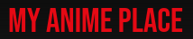
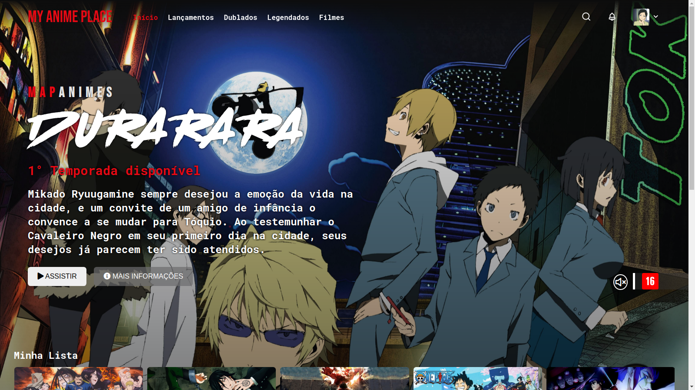

# MY ANIME PLACE 

My Anime Place é um projeto na tentativa de clonar visualmente o site da Netflix,a partir de conceitos inicias do projeto da Digital Innovation One utilizando o framework Jquery para fazer o carrosel do site. É um prejeto apenas visual, sem nenhuma interatividade, composto majoritariamente por HTML/CSS.

## Conteúdos

- [Overview](#overview)
  - [Como rodar o projeto](#como-rodar-o-projeto)
  - [Como utilizar](#como-utilizar-o-projeto)
  - [Screenshot](#screenshot)
  - [Links](#links)
- [Processo](#processo)
  - [Tecnologia utilizadas](#tecnologias-utilizadas)
  - [O que eu aprendi](#o-que-eu-aprendi)
  - [Continuação do desenvolvimento](#continuacao-do-desenvolvimento)
- [Autor](#autor)

## Overview

### Como rodar o projeto

 1. Primeiramente é necessário ter o nodeJS instalado(caso não tenha, apenas baixe a pasta zip do projeto).
 2. Clone o projeto com `https://github.com/pedrolucazx/MyAnimePlace.git`.
 3. Após clonar o projeto, basta apenas abrir o html principal do site e utilizar as suas funcionalidade.

 ### Como utilizar

 1. Apenas visualizar as similaridades do site original: [Netflix](https://www.netflix.com/browse).
 2. Pode-se também passar entre os animes no carrosel do site.

### Screenshot

### Links
- Site hospedado: [My Anime Place](https://pedrolucazx.github.io/MyAnimePlace/)

## Processo

### Tecnologias utilizadas:

### O que eu aprendi
 - Utilização da biblioteca Jquery - Owl Carousel para colocar um carrosel
 - Posicionamento, usando flexbox e position.
 - Como fazer um bom README.
 - Conceitos de responsividade.

### Continuação do desenvolvimento
 - Seleção de perfil de usúario ao acessar a página.
 - Adicionar a navbar fixa na parte inferior, como no app da Netflix.
 - Reecriar novamente usando ReactJS 

## Autor
- Linkedin - [Pedro Lucas](https://www.linkedin.com/in/pedrolucazx/)
- GitHub - [pedrolucazx](https://github.com/pedrolucazx)
